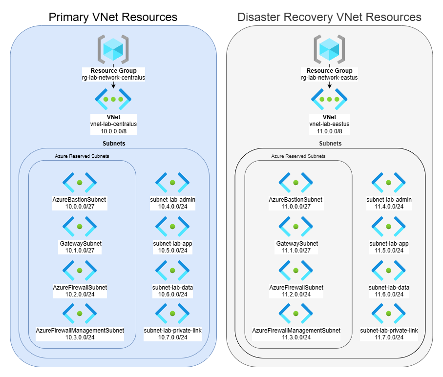

# Azure Virtual Network
This repository contains Bicep templates for deploying a Primary and a Disaster Recovery **Azure Virtual Network (VNet)**. 

## Dependencies

This project uses Azure Verified Modules (AVM) for deploying Azure resources with Bicep.

For official module documentation and references, see the Bicep Registry Modules (AVM) repository:

https://github.com/Azure/bicep-registry-modules

---

## How to run it

```powershell 
az login
cd ../scripts
./deploy-network.ps1
```

## Resource Group and VNet Build


## What gets deployed
- **Resource Groups**
- **Resource Group Locks**
- **Virtual Networks (VNet)**
- **Subnets**